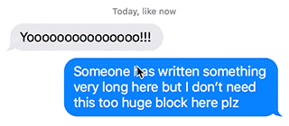
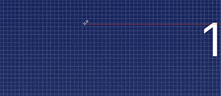

# Push and Shove
A tiny Sketch plugin for manipulating layers in various evil ways:

- Resize layers backwards (from the bottom right edge) by just adding ```^``` to your combo: ```^ ⌘ →``` (ctrl + cmd + any arrow key) and ```^ ⇧ ⌘ →``` for 10px (ctrl + shift + cmd + any arrow key)

Like this



- Move layers half a pixel in any direction with ```^ ⎇ →``` (ctrl + alt + any arrow key)
- Resize layers half a pixel in any direction with ```^ ⇧ ⎇ →``` (ctrl + shift + alt + any arrow key)

And this



- Align layers horizontally and vertically, down to half pixels accuracy with ```⌘ [``` and ```⌘ ]``` (cmd + bracket keys).

Or maybe this


Also:

- Toggle the proportions constraint of layers with ```^ ⌘ c``` (ctrl + cmd + C).
- Replace a layer with one(s) you've just copied with ```^ ⇧ ⌘ v``` (ctrl + shift + cmd + V).

## How to Install
1. Download and open ```push-and-shove-master.zip```
2. Open ```push-and-shove.sketchplugin``` (Sketch will automatically install the plugin)

## Notes
* Tested on Sketch 3.8.3
* Toggle proportions constraint works with any layers except for text and slices
* Since Sketch 3.7, canvas somtimes flashes after performing one of the plugin actions, haven't figured out yet how to fix this :)